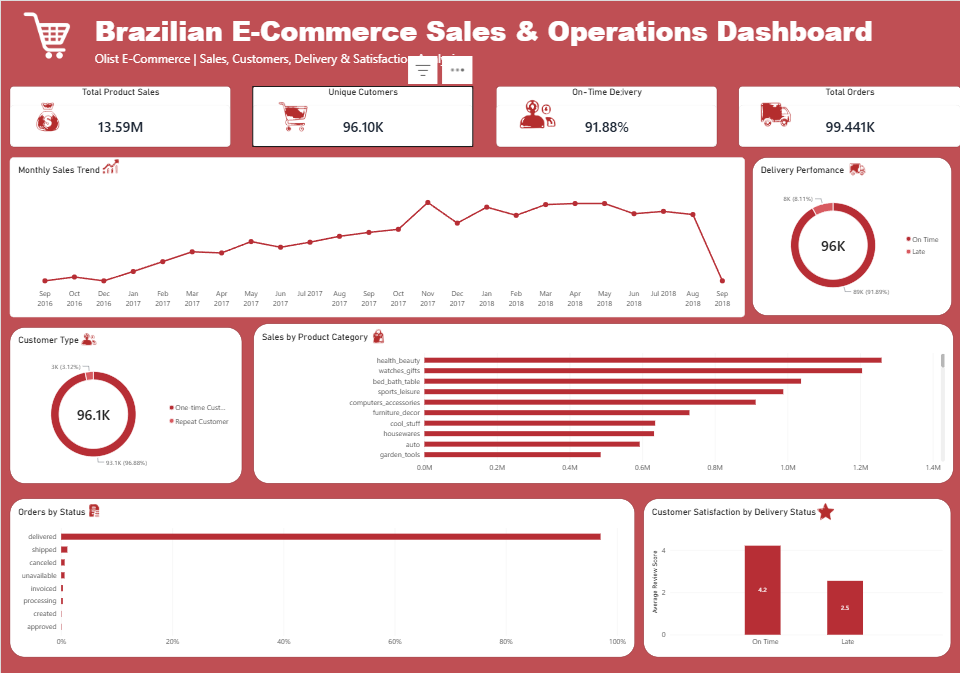

# Brazilian E-Commerce Sales & Operations Analytics

### Mohammad Farhan
**MBA — Business Analytics & Artificial Intelligence | Middlesex University Dubai**

**Business/Data Analyst | SQL | Power BI | Excel | Python | AI & Predictive Analytics**

---

## 📊 Project Overview

This project analyzes the Brazilian E-Commerce Public Dataset by Olist to understand sales performance, customer behavior, delivery operations, product category performance, and customer satisfaction.

The project combines PostgreSQL, SQL, Power BI, and DAX to transform raw transactional data into actionable business insights.

## 📊 Project Overview

This project analyzes the Brazilian E-Commerce Public Dataset by Olist to understand sales performance, customer behavior, delivery operations, product category performance, and customer satisfaction.

The project combines PostgreSQL, SQL, Power BI, and DAX to transform raw transactional data into actionable business insights.

---

## 🎯 Business Objectives

The analysis aims to answer the following business questions:

- How are sales and orders performing over time?
- Which product categories generate the most sales?
- How many unique and repeat customers does the business have?
- How efficient is the delivery operation?
- Is delivery performance associated with customer satisfaction?
- What is the distribution of order statuses?
- Where are there opportunities to improve customer retention and operational performance?

---

## 🛠️ Tools & Technologies

- **PostgreSQL** — Data storage and SQL analysis
- **SQL** — Data validation, transformation, joins and business analysis
- **Power BI** — Interactive dashboard and data visualization
- **DAX** — KPI calculations and customer segmentation
- **Excel** — Initial data handling and validation

---

## 🗂️ Dataset

The project uses the Brazilian E-Commerce Public Dataset by Olist.

The dataset contains approximately 100K orders and includes information about:

- Orders
- Customers
- Products
- Sellers
- Order Items
- Payments
- Reviews
- Geolocation
- Product Categories

---

## 🔄 Project Workflow

Raw Olist Dataset  
↓  
PostgreSQL Database  
↓  
Data Quality & Validation  
↓  
SQL Analysis  
↓  
Analytical SQL View  
↓  
Power BI Data Model  
↓  
DAX Measures & Calculated Columns  
↓  
Interactive Business Dashboard  
↓  
Business Insights & Recommendations

---

## 📈 Key KPIs

| KPI | Result |
|---|---:|
| Total Product Sales | 13.59M |
| Total Orders | 99,441 |
| Unique Customers | 96.10K |
| On-Time Delivery | 91.88% |
| Average Order Value | 160.58 |
| Average Delivery Time | 12.56 days |
| Average Estimated Delivery | 23.74 days |

---

## 🔍 Key Business Insights

### 1. Delivery Performance & Customer Satisfaction

On-time orders received an average review score of approximately **4.29/5**, while late orders received approximately **2.57/5**.

This indicates a strong association between delivery performance and customer satisfaction.

> Note: This analysis identifies an association and does not establish causation.

---

### 2. Customer Retention

Approximately **96.9% of customers were one-time customers**, while only around **3.1% were repeat customers**.

Repeat customers generated approximately **88% higher sales per customer** than one-time customers.

This suggests a significant opportunity to improve customer retention and repeat purchasing.

---

### 3. Product Category Performance

High-performing categories included:

- Health & Beauty
- Watches & Gifts
- Bed/Bath/Table
- Sports & Leisure
- Computers & Accessories

Category-level analysis can support inventory planning, merchandising and promotional decisions.

---

### 4. Customer Reviews

Approximately **57.8% of reviews were 5-star**, while approximately **11.5% were 1-star**.

Combining review data with delivery performance provides additional insight into the relationship between operational execution and customer experience.

---

## 💡 Business Recommendations

### Improve Customer Retention

Develop targeted campaigns for first-time customers, such as personalized recommendations, loyalty incentives and post-purchase engagement.

### Monitor Late Deliveries

Identify sellers, regions and product categories associated with higher delivery delays and investigate operational causes.

### Optimize High-Performing Categories

Use category-level sales trends to support inventory allocation, merchandising and marketing decisions.

### Investigate Low Customer Ratings

Analyze orders receiving low review scores alongside delivery performance and other operational factors to identify potential service issues.

---

## 📊 Power BI Dashboard

The dashboard provides an interactive overview of:

- Sales performance
- Monthly sales trends
- Product category sales
- Delivery performance
- Customer satisfaction
- Customer type
- Order status distribution

### Dashboard Preview



---

## 🧮 SQL Analysis

PostgreSQL was used to:

- Validate row counts across source tables
- Check missing values
- Validate primary-key uniqueness
- Validate relationships between tables
- Join transactional datasets
- Aggregate payments and reviews
- Calculate delivery metrics
- Analyze customer purchasing behavior
- Analyze product category performance
- Create an analytical SQL view for Power BI

---

## 📐 Power BI & DAX

DAX was used to create business metrics including:

- Total Product Sales
- Total Orders
- Unique Customers
- On-Time Delivery %
- Customer Type
- Average Customer Rating

Customer segmentation was created to distinguish between **One-time Customers** and **Repeat Customers**.

---

## 📁 Project Structure

```text
Olist_Ecommerce_Project
│
├── SQL
│   └── olist_analysis.sql
│
├── PowerBI
│   └── Olist_Ecommerce_Dashboard.pbix
│
├── Screenshots
│   └── dashboard.png
│
├── Raw_Data
│
└── README.md

## 👤 Author

### Mohammad Farhan

MBA in Business Analytics & Artificial Intelligence  
Middlesex University Dubai

**Core Skills:**  
SQL | PostgreSQL | Power BI | DAX | Excel | Python | Business Analytics | AI & Predictive Analytics